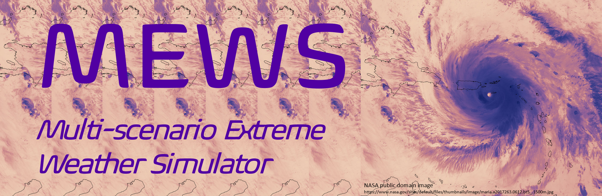

[](https://mews.readthedocs.io/en/latest/?badge=latest)


The Multi-scenario Extreme Weather Simulator (MEWS) is a Python package designed to add
extreme weather events to existing weather data or projections. MEWS does not simulate
weather but rather adds variations in weather for the purpose of probabilistic analyses 
of infrastructure or environmental systems. 

Currently MEWS works for extreme temperature. Other enhancements to MEWS are envisioned that provide reasonably realistic selection
of hurricane futures and extreme precipitation.

Currently the infrastructure focus has been for Building Energy Simulation and MEWS can read/write
altered weather files for Energy Plus (https://energyplus.net/) and DOE-2 (https://www.doe2.com/)
weather files. Both of these provide a rich library of historic and Typical Meteorological weather
inputs around the world. 

MEWS has been tested on Linux, Max-OS, and Windows using Python 3.8, 3.9, and 3.10. 
Documentation will also follow in the near future.

License
------------

See the LICENSE.md file for license details. This package has third party packages that have their own licenses that are appended to the MEWS license.

Organization
------------

Directories
  * mews - Python package
  * dist - wheel and tar.gz binaries for installing mews 1.1
  * docs - UNDER CONSTRUCTION - inital build available on ReadTheDocs (https://mews.readthedocs.io/en/latest/)
  * information - contains general information about MEWS
  * examples - current working example is run_mews_extreme_temperature_example_v_1_1.py. All others are deprecated or use older techniques

Installation
------------
  * To install the latest released version:
    
    ```
    pip install mews
    ```
    
    For the current code:
    
    ```
    cd < a directory you want to work with >
    python -m venv <a virtual environment name>
    <a virtual environment name>/Scripts/activate
    git clone git@github.com:sandialabs/MEWS.git
    cd MEWS
    pip install -e .
    ```
    If this does not work an alternative method is to:
    
    ```
    cd < a directory you want to work with >
    python -m venv <a virtual environment name>
    <a virtual environment name>/Scripts/activate
    git clone git@github.com:sandialabs/MEWS.git
    cd MEWS
    pip install -r requirements.txt
    python setup.py develop
    ```
    
    Then run the following to ensure the code passes unit testing
    
    ```
    pip install pytest
    pytest
    ```
    
    All tests should pass. Sometimes failures occur if you have tex on your computer.
    
    The API for MEWS is only documented in the code and has many inputs. The best example of how to use the latest version is available in examples/run_mews_extreme_temperature_example_v_1_1.py
    the other examples are either depricated or are not being kept up to date presently.

Other Installation Requirements
-------------------------------
  * MEWS requires Cython which needs a C compiler in place. For windows, this can be the visual studio free Microsoft Visual C++ 14.0 Build Tools 
that are freely available at https://visualstudio.microsoft.com/visual-cpp-build-tools/. Download the build tools and install them. It is necessary
to assure the correct version of the build tools is installed. The stack exchange thread below shows how to verify the correct version is installed.

https://stackoverflow.com/questions/66838238/cython-setup-py-cant-find-installed-visual-c-build-tools

   * MEWS downloads CMIP6 data when using the ClimateScenario class. This step can be messy though and requires many retries when downloading the data live from multiple servers. As a result, the entire dataset (~24Gb) has been uploaded to https://osf.io/ts9e8/files/osfstorage and is publicly available to manually download.

Download the CMIP6_Data_Files file and then make its local path equal to the "output_folder" parameter for the ClimateScenario class in

mews.weather.climate.ClimateScenario

Using MEWS
--------
A training video has been made available at: https://drive.google.com/file/d/1B-G5yGu0BFXCqj0BYfu_e8XFliAoeoRi/view?usp=drive_link

MEWS has many classes that have their API's documented in the code. These classes have specialized functions that most users will not want to work with.
The MEWS function for heat waves is:

```
from mews.run_mews import extreme_temperature
```

The example in MEWS/examples/run_mews_extreme_temperature_v_1_1.py shows how to use extreme_temperature. The repository now contains
pre-processed solution files for the following cities:         

```
cities = ["Chicago",
          "Baltimore",
          "Minneapolis",
          "Phoenix",
          'Miami',
          'Houston'
          'Atlanta', 
          'LasVegas',
          'LosAngeles',
          'SanFrancisco',
          'Albuquerque',
          'Seattle', 
          'Denver',
          'Helena', 
          'Duluth',
          'Fairbanks',
          'McAllen',
          'Kodiak',
          'Worcester']
 ```
         
The extreme_temperature input parameters can be used to only generate files from the solutions rather than running the lengthy optimization process again.

Inside "MEWS/examples/example_data" are folders for each city and inside these folders you can find the solution files in "results" and "mews_epw_results" folder for EnergyPlus epw files. 

Contact 
--------

   * Daniel Villa, Sandia National Laboratories (SNL) dlvilla@sandia.gov
   
Citing MEWS
-----------
You can cite MEWS with one of the following:

* Villa, Daniel L., Tyler J. Schostek, Krissy Govertsen, and Madeline Macmillan. 2023. "A Stochastic Model of Future Extreme Temperature Events for Infrastructure Analysis." _Environmental Modeling & Software_ https://doi.org/10.1016/j.envsoft.2023.105663.

* Villa, Daniel L., Juan Carvallo, Carlo Bianchi, and Sang Hoon Lee. 2022. "Multi-scenario Extreme Weather Simulator Application to Heat Waves." _2022 Building Performance Analysis Conference and SimBuild co-organized by ASHRAE and IBPSA-USA_ https://doi.org/10.26868/25746308.2022.C006


Sandia Funding Statement
------------------------
Sandia National Laboratories is a multimission laboratory managed and operated by National Technology and Engineering Solutions of Sandia, LLC., a wholly owned subsidiary of Honeywell International, Inc., for the U.S. Department of Energy's National Nuclear Security Administration under contract DE-NA-0003525.

